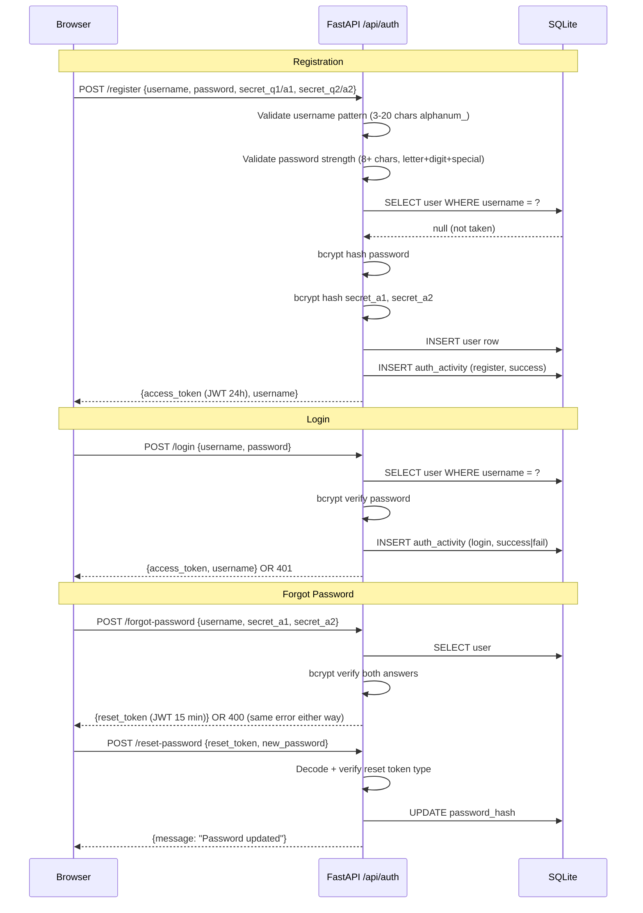
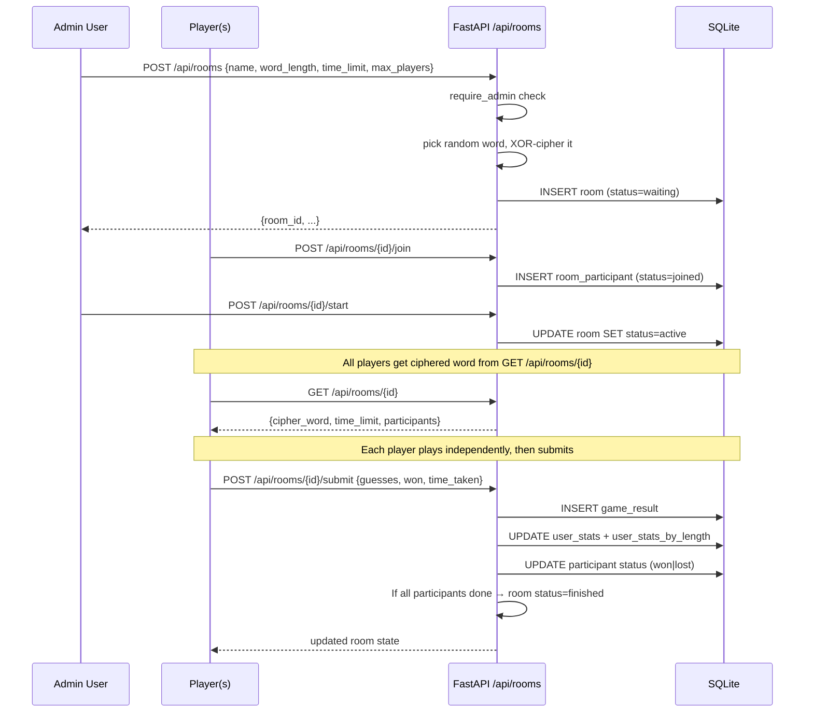

# Wordle Elite

A full-stack multiplayer Wordle clone with per-mode leaderboards, room-based competitions, and a cyberpunk city background.

**Stack:** React 18 + Vite · FastAPI · SQLAlchemy · SQLite · bcrypt · PyJWT

---

## Table of Contents

1. [Features](#features)
2. [Architecture](#architecture)
3. [Auth Flow](#auth-flow)
4. [Game Flow](#game-flow)
5. [Room (Multiplayer) Flow](#room-multiplayer-flow)
6. [Leaderboard Flow](#leaderboard-flow)
7. [Project Structure](#project-structure)
8. [Quick Start](#quick-start)
9. [Environment Variables](#environment-variables)
10. [API Reference](#api-reference)
11. [Security Notes](#security-notes)

---

## Features

| Feature | Detail |
|---|---|
| Word lengths | 3 · 4 · 5 · 6 · 7 letters |
| Attempts | 4 – 8 (scales with word length) |
| Countdown timer | Per-mode time limit with LED clock |
| Auth | Register / Login / Forgot password (security questions) |
| Leaderboard | Filter by word length · Sort by wins / win% / best time / played / streak |
| Multiplayer rooms | Admin creates → players join → all submit → auto-finish |
| Themes | 15 colour themes + animated city / hyperspace / warp backgrounds |

---

## Architecture

```
┌──────────────────────────────────────────────────────┐
│                    Browser (React)                    │
│                                                      │
│  App.jsx  ──►  Auth screen (register / login / reset)│
│           ──►  Lobby (mode select · stats · leaderboard · create room) │
│           ──►  Game (word grid · timer · result panel)│
│                                                      │
│  api.js sends JWT Bearer token on every request      │
└──────────────────┬───────────────────────────────────┘
                   │  HTTP/JSON  (VITE_API_URL)
                   ▼
┌──────────────────────────────────────────────────────┐
│                  FastAPI  (Python)                   │
│                                                      │
│  /api/auth/*        Auth router                      │
│  /api/game/*        Game router                      │
│  /api/rooms/*       Room router                      │
│  /api/leaderboard/* Leaderboard router               │
│  /api/admin/*       Admin router (ROOT_USER only)    │
│                                                      │
│  dependencies.py  ──  JWT decode ──  get_current_user│
│  models.py        ──  SQLAlchemy ORM                 │
│  config.py        ──  pydantic-settings (.env)       │
└──────────────────┬───────────────────────────────────┘
                   │  SQLAlchemy
                   ▼
         ┌─────────────────┐
         │   SQLite DB      │
         │  (wordleee.db)   │
         │                 │
         │  users           │
         │  auth_activity   │
         │  user_stats      │
         │  user_stats_by_length │
         │  game_results    │
         │  rooms           │
         │  room_participants│
         └─────────────────┘
```

---

## Auth Flow



---

## Game Flow

```mermaid
flowchart TD
    A([User opens Lobby]) --> B[Selects word length 3-7]
    B --> C[Clicks Play]
    C --> D[GET /api/game/word?length=N\nserver returns XOR-ciphered word]
    D --> E[Client deciphers word in browser\nplaintext never on wire]
    E --> F{Game loop}
    F --> G[User types guess]
    G --> H{Valid word length?}
    H -- No --> G
    H -- Yes --> I[Evaluate guess\nCorrect / Present / Absent]
    I --> J{Won or no attempts left or timer = 0}
    J -- Continue --> F
    J -- Done --> K[POST /api/game/submit\n{word_length, guesses, won, time_taken}]
    K --> L[Server updates UserStats + UserStatsByLength\nbest_time tracked per word length]
    L --> M[Show result panel]
    M --> N([Back to Lobby])
```

---

## Room (Multiplayer) Flow



---

## Leaderboard Flow

```mermaid
flowchart LR
    A[GET /api/leaderboard\n?word_length=5&sort_by=best_time] --> B{word_length param?}
    B -- Yes --> C[Query user_stats_by_length\nWHERE word_length = N]
    B -- No --> D[Query user_stats\nglobal all-lengths]
    C --> E[ORDER BY sort_by\nwins / win_pct / best_time / played / streak]
    D --> E
    E --> F[Return ranked list\n{rank, username, played, won, win_pct,\nstreak, max_streak, best_time}]
```

---

## Project Structure

```
wordleee/
├── frontend/                  React + Vite SPA
│   ├── src/
│   │   ├── App.jsx            Root: auth ↔ lobby ↔ game state machine
│   │   ├── Lobby.jsx          Mode select, leaderboard, create room
│   │   ├── Game.jsx           Word grid, keyboard, timer, result panel
│   │   ├── CityBg.jsx         Animated canvas background (3 variants)
│   │   ├── api.js             All fetch calls, JWT storage
│   │   ├── index.css          Design tokens (CSS variables, 15 themes)
│   │   └── assets/            Background images + SVGs
│   ├── .env.example
│   └── package.json
│
└── backend/                   FastAPI + SQLAlchemy
    ├── main.py                App factory, CORS, router includes
    ├── config.py              pydantic-settings — reads .env
    ├── database.py            SQLAlchemy engine + session
    ├── models.py              ORM models (all 7 tables)
    ├── schemas.py             Pydantic request/response schemas
    ├── dependencies.py        get_current_user, require_admin
    ├── auth/
    │   ├── router.py          POST /register /login /forgot-password /reset-password
    │   ├── service.py         Business logic (hash answers, log activity)
    │   └── utils.py           bcrypt helpers, JWT encode/decode
    ├── game/
    │   ├── router.py          GET /word  POST /submit
    │   ├── service.py         submit_game, stat helpers, streak logic
    │   └── words.py           Word lists + XOR cipher
    ├── room/
    │   ├── router.py          CRUD + join/start/submit
    │   └── service.py         Room lifecycle, per-length stats
    ├── leaderboard/
    │   ├── router.py          GET / (filtered) + GET /me + GET /{username}
    │   └── service.py         get_leaderboard, get_user_stats
    ├── admin/
    │   └── router.py          GET /show-all-user-data (admin only)
    ├── .env.example           ← copy to .env and fill in
    ├── requirements.txt
    └── .gitignore
```

---

## Quick Start

### Prerequisites

- Python 3.11+
- Node.js 18+

### 1 — Backend

```bash
cd wordleee/backend

# Create virtual environment
python3 -m venv .venv
source .venv/bin/activate          # Windows: .venv\Scripts\activate

# Install dependencies
pip install -r requirements.txt

# Configure environment
cp .env.example .env
# Edit .env — set JWT_SECRET to a random 32+ char string:
# python3 -c "import secrets; print(secrets.token_hex(32))"

# Run dev server
uvicorn main:app --reload --port 8000
```

Swagger UI: http://localhost:8000/docs

### 2 — Frontend

```bash
cd wordleee/frontend

npm install

# (Optional) set API URL if backend is not on localhost:8000
# echo "VITE_API_URL=http://localhost:8000" > .env

npm run dev
```

App: http://localhost:5173

### 3 — Create admin account

Register normally with username `admin` (matches `ROOT_USER` in `.env`). That account automatically gets admin privileges for creating rooms.

---

## Environment Variables

### Backend (`backend/.env`)

| Variable | Required | Default | Description |
|---|---|---|---|
| `JWT_SECRET` | **Yes** | — | Random 32+ byte string. App refuses to start if missing or too short. |
| `DATABASE_URL` | No | `sqlite:///./wordleee.db` | SQLAlchemy connection string |
| `JWT_ALGORITHM` | No | `HS256` | JWT signing algorithm |
| `ACCESS_TOKEN_EXPIRE_HOURS` | No | `24` | Access token lifetime |
| `RESET_TOKEN_EXPIRE_MINUTES` | No | `15` | Password-reset token lifetime |
| `ROOT_USER` | No | `admin` | Username that gets admin access |

### Frontend (`frontend/.env`)

| Variable | Required | Default | Description |
|---|---|---|---|
| `VITE_API_URL` | No | `http://localhost:8000` | Backend base URL |

---

## API Reference

### Auth

| Method | Path | Auth | Description |
|---|---|---|---|
| POST | `/api/auth/register` | — | Create account, returns JWT |
| POST | `/api/auth/login` | — | Login, returns JWT |
| POST | `/api/auth/forgot-password` | — | Verify security answers, returns reset token |
| POST | `/api/auth/reset-password` | — | Set new password using reset token |

### Game

| Method | Path | Auth | Description |
|---|---|---|---|
| GET | `/api/game/word?length=N` | Bearer | Get XOR-ciphered word (N = 3–7) |
| POST | `/api/game/submit` | Bearer | Submit result, updates stats |

### Rooms

| Method | Path | Auth | Description |
|---|---|---|---|
| POST | `/api/rooms` | Admin | Create room |
| GET | `/api/rooms` | Bearer | List open rooms |
| GET | `/api/rooms/{id}` | Bearer | Room detail + cipher word (if active participant) |
| POST | `/api/rooms/{id}/join` | Bearer | Join a room |
| POST | `/api/rooms/{id}/start` | Admin | Start the room |
| POST | `/api/rooms/{id}/submit` | Bearer | Submit room result |

### Leaderboard

| Method | Path | Auth | Query params | Description |
|---|---|---|---|---|
| GET | `/api/leaderboard` | Bearer | `limit`, `word_length`, `sort_by` | Ranked leaderboard |
| GET | `/api/leaderboard/me` | Bearer | `word_length` | Your stats |
| GET | `/api/leaderboard/{username}` | Bearer | `word_length` | Any player's stats |

**`sort_by` values:** `wins` · `win_pct` · `best_time` · `played` · `streak`

### Admin

| Method | Path | Auth | Description |
|---|---|---|---|
| GET | `/api/admin/show-all-user-data` | Admin | All users + auth activity |

---

## Security Notes

| Area | Status | Note |
|---|---|---|
| Passwords | Hashed (bcrypt) | |
| Security answers | Hashed (bcrypt) | Answers are hashed before storage; verification uses `bcrypt.verify` |
| JWT secret | Required, 32+ bytes | App startup fails if `.env` is missing or secret is too short |
| Credentials file | Git-ignored | `local.settings.json`, `.env`, `*.db` are all in `.gitignore` |
| SQL injection | Not present | All queries go through SQLAlchemy ORM |
| Admin answers exposed | Fixed | Admin endpoint returns questions only, never answer hashes |
| Legacy Azure Function | Removed | `function_app.py` had wildcard CORS and anonymous auth — deleted |
| CORS | Dev-only origins | `localhost:5173` only; update `main.py` for production domain |
| JWT storage | `localStorage` | Acceptable for a learning project; prefer HttpOnly cookies in production |
| Game result forgery | Known limitation | `won`/`time_taken` are client-supplied; server-side session verification is a future improvement |
| Rate limiting | Not implemented | Add `slowapi` for production to throttle login and forgot-password |
