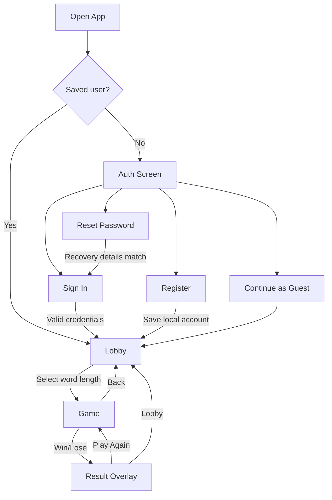
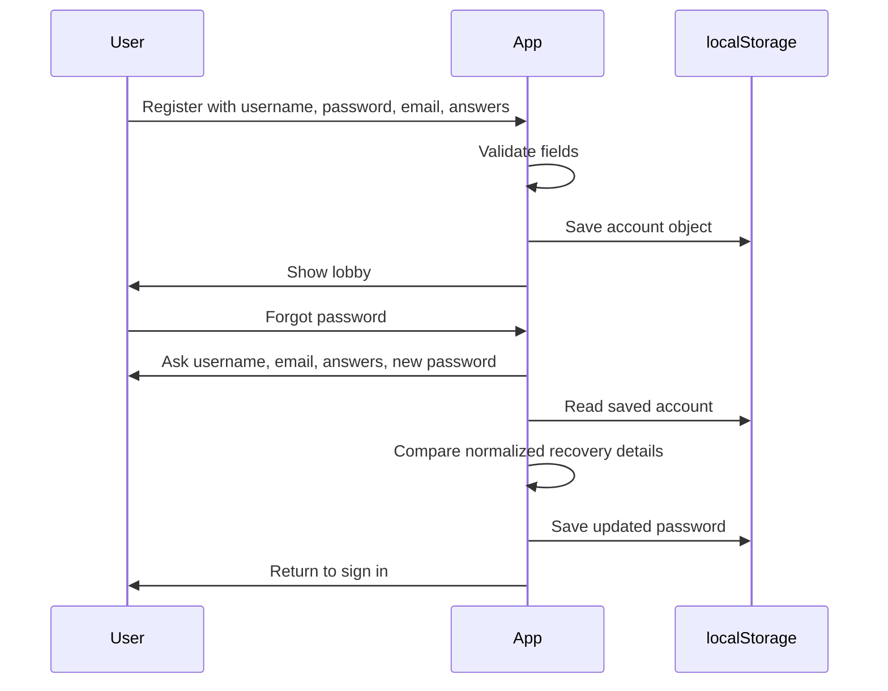
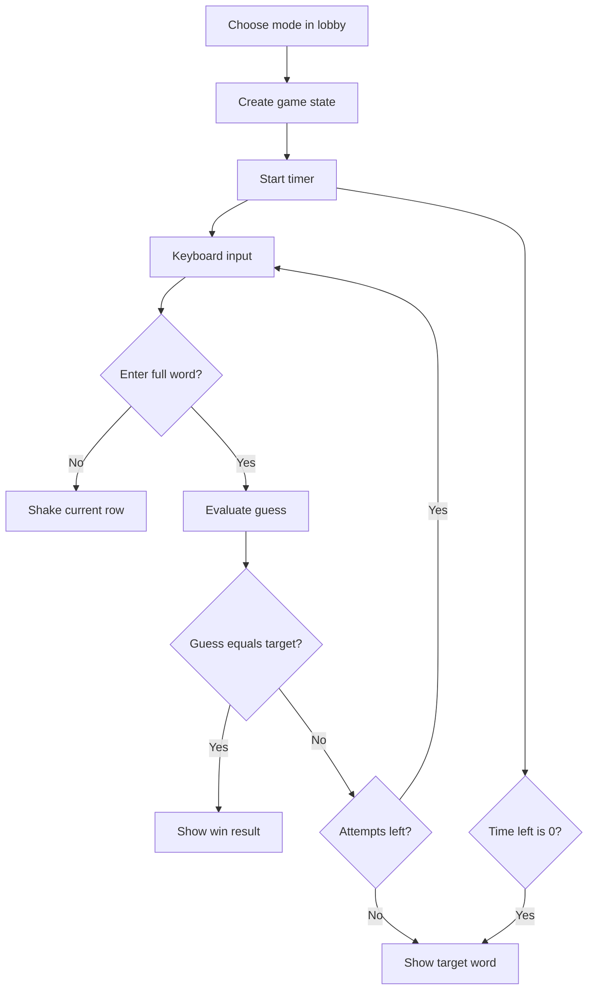

# Wordle Auth

Wordle Auth is a React + Vite Wordle-style game with a local authentication flow, recovery-based password reset, theme switching, a lobby, and timed gameplay.

The app is currently frontend-only. User account data, selected theme, and placeholder stats are stored in browser `localStorage`.

## Tech Stack

- React 19
- Vite 8
- JavaScript JSX
- CSS custom properties for themes
- Oxlint for linting
- Browser `localStorage` for local demo persistence

## Features

- Sign in, register, and password reset screens
- Register form with username, password, email, and two recovery answers
- Simple password reset using username, email, and recovery answers
- Guest mode
- 16 selectable themes
- Lobby with game modes, local stats, and leaderboard mock data
- Wordle gameplay for 3 to 7 letter words
- Timed rounds with visual clock
- On-screen and physical keyboard support
- Animated city background shared across auth, lobby, and game screens

## Getting Started

Install dependencies:

```bash
npm install
```

Start the local dev server:

```bash
npm run dev
```

Build for production:

```bash
npm run build
```

Preview the production build:

```bash
npm run preview
```

Run lint:

```bash
npm run lint
```

## Project Structure

```text
wordle-auth/
  public/
    favicon.svg
    icons.svg
  src/
    App.jsx        Auth flow, theme state, app screen switching
    App.css        Auth page and theme selector styles
    CityBg.jsx     Shared animated city background
    CityBg.css     Background animation styles
    Game.jsx       Wordle game logic and UI
    Game.css       Game board, keyboard, timer, result styles
    Lobby.jsx      Mode selection, stats, leaderboard, room button
    Lobby.css      Lobby layout and controls
    index.css      Global tokens and theme definitions
    main.jsx       React entry point
  package.json
  vite.config.js
```

## App Flow



## Auth And Recovery Flow



## Game Flow



## Code Overview

### `App.jsx`

Owns the top-level screen state:

- `auth`
- `lobby`
- `game`

It also contains the local auth forms:

- `LoginForm`
- `RegisterForm`
- `ResetPasswordForm`

Storage helper functions keep repeated `localStorage` code in one place:

- `getSavedUser`
- `saveUser`
- `clearSavedUser`
- `readStoredJson`

Validation helpers keep each form explicit:

- `validateLoginForm`
- `validateRegistrationForm`
- `validatePasswordResetForm`

The auth system is intentionally local-only for this frontend demo. A backend service should replace this before real production use.

### `Lobby.jsx`

Displays available modes and reads local placeholder stats. The mode list is static and maps word length to attempts and time.

Key helpers:

- `getModeByLength`
- `readLocalStats`
- `getWinRate`

### `Game.jsx`

Contains the Wordle engine and UI components.

Core logic:

- `getRandomTargetWord` selects the target word.
- `evaluateGuess` marks letters as `correct`, `present`, or `absent`.
- `getLetterStates` builds keyboard coloring.
- `gameReducer` handles key input, enter, backspace, timeout, and reset.
- `createInitialGameState` creates a new round.

UI pieces:

- `TechClock`
- `Grid`
- `Tile`
- `Keyboard`
- `ResultOverlay`

### `CityBg.jsx`

Renders the shared animated city scene behind every screen. Images are imported as Vite assets so the build pipeline fingerprints them.

### `index.css`

Defines global design tokens and all theme variants:

`dark`, `matrix`, `ocean`, `neon`, `solar`, `ember`, `aurora`, `cyber`, `crimson`, `gold`, `frost`, `grape`, `mint`, `rose`, `steel`, `sunset`.

## Local Storage Keys

```text
wordle_elite_user
wordle_elite_theme
wordle_elite_stats
```

Example saved user shape:

```json
{
  "username": "cool_player",
  "email": "you@example.com",
  "password": "Pass1234",
  "recoveryAnswers": ["nickname", "teacher"]
}
```

## Important Security Note

This app stores password and recovery data in `localStorage` because it is currently a frontend-only demo. That is not secure for real production auth.

Production upgrade path:

- Move account data to a backend.
- Hash passwords server-side.
- Store recovery answers as hashed values.
- Use sessions or secure HTTP-only cookies.
- Add rate limiting for login and reset attempts.

## Verification Checklist

After changes, run:

```bash
npm run build
npm run lint
```

Manual smoke test:

1. Register a new user.
2. Log out.
3. Sign in with the saved username and password.
4. Log out again.
5. Use Forgot password with username, email, and both recovery answers.
6. Sign in with the new password.
7. Start a game from the lobby.
8. Submit guesses with both physical and on-screen keyboard input.
